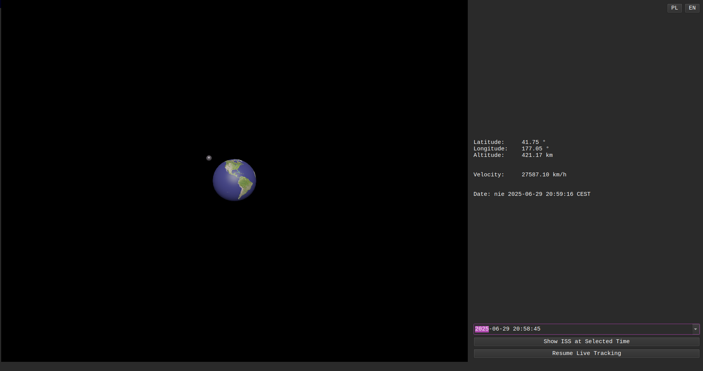
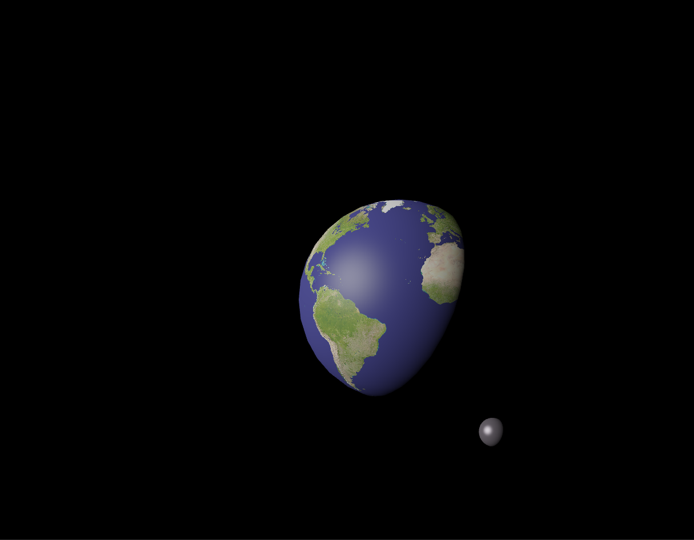
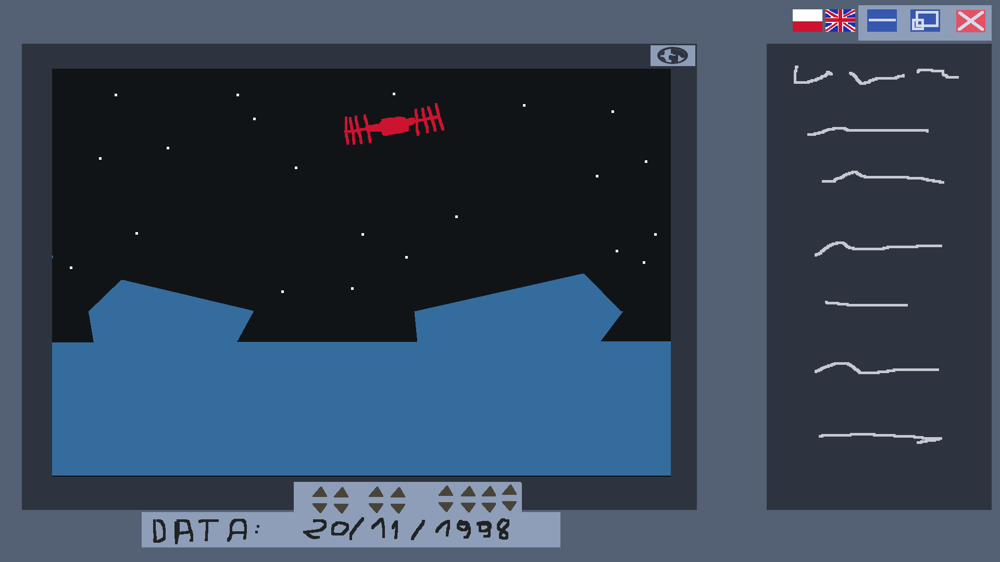

# aimHigh – ISS Tracking Application  

**aimHigh** is a project developed for the **Data Visualization course** at **Wrocław University of Science and Technology**.  
It is a **Qt-based application** designed to track the **International Space Station (ISS)** in real time.  

The application retrieves live ISS orbital data from the [WhereTheISS.at API](https://wheretheiss.at) and presents it through interactive visualizations.  

---

## Application Overview  

The project consists of **three main widgets**:  

1. **Main Window**  
   - Realistic 3D Earth model with a simplified ISS station (created in Blender)  
   - Dynamic rendering with realistic sun reflections  

2. **ISS Statistics**  
   - Displays longitude, latitude, altitude, speed, and current time  

3. **Timeline**  
   - Allows users to select any custom date  
   - Checks older data (or Predicts future) and visualizes the ISS position at that time  

---

##  Screenshots  

Main window with Earth and ISS:  

  

  

Realistic sun reflections:  

  

  

Early-stage layout design (prototype):  

  

  

---

##  Technologies  

- **C++ / Qt** - GUI and core logic  
- **Blender** - 3D models  
- **OpenGL** - Rendering support  
- **API (WhereTheISS.at)** → ISS orbital data  

---
